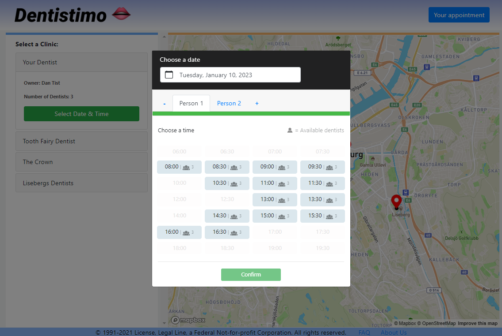

# Dentistimo _(School Project)_

# Table of Contents
#### System
1. [Purpose of the System](#reason)
2. [System Setup](#setup)

#### Software Development
3. [Software Architecture](#arch)
4. [Diagrams](#diagrams)
5. [Softwares & Tools](#sat)
6. [Technical Information](#tech)

#### Project Management
7. [Members](#members)
8. [Team Agreement](#ta)  
9. [Management Brief](#brief)
10. [Project Management Tools](#pmt)
11. [Project Velocity (Burndown Chart)](#pvbc)
12. [Trello Board Management - Project Snapshot!](#tbm)
13. [Diagram Version Control Management](#dvcm)

#### Others
14. [References](#ref)
15. [Limitation and known bugs](#bug)

# Purpose of the System
<a name="reason"/>

### What sort of system will we create?
We will create a web service that allows residents of Gothenburg to book dentist appointments. Through a graphical user interface, a user shall be able to find available times in user-specified time-windows, and be able to book a time for their dental care appointment.

### Why did we make this system?

Our customer was in need of a system which would be able to handle the booking of a dental appointment from one of a selection of clinics in Gothenburg. 

### How are we going to create the system?
The system will be built by creating different components, which will all interact over a centralized MQTT broker. Since this system will be built as a distributed system, we will need MQTT functionality in all components. MongoDB coupled with Mongoose will be used in all the server components ([Clinic Manager](https://git.chalmers.se/courses/dit355/test-teams-formation/team-10/clinicmanager), [Availability Checker](https://git.chalmers.se/courses/dit355/test-teams-formation/team-10/availabilitychecker/-/blob/main/README.md), [Booking Manager](https://git.chalmers.se/courses/dit355/test-teams-formation/team-10/bookingmanager/-/blob/main/README.md)), in order to read and save important information related to clinics, bookings, and appointment availabilities. The web-application ([ClientUI](https://git.chalmers.se/courses/dit355/test-teams-formation/team-10/clientui)) will be using MapBox, Vue and Vuex technologies

# System Setup
<a name="setup"/>
The system consist of 4 components, which all need to be setup and running for the whole system to function. We reccommend downloading, installing, and running these components in the order in which they are listed below. The setup process is the same in Clinic Manager, Availability Checker, and in Booking Manager. For further setup instructions related to all system components, refer to the documentation links below.

### Components
* [Setup the Client UI](https://git.chalmers.se/courses/dit355/test-teams-formation/team-10/clientui/-/blob/main/README.md)
* [Setup the Clinic Manager](https://git.chalmers.se/courses/dit355/test-teams-formation/team-10/clinicmanager/-/blob/main/README.md)
* [Setup the Availability Checker](https://git.chalmers.se/courses/dit355/test-teams-formation/team-10/availabilitychecker/-/blob/main/README.md)
* [Setup the Booking Manager](https://git.chalmers.se/courses/dit355/test-teams-formation/team-10/bookingmanager/-/blob/main/README.md)

# Software Architecture
<a name="arch"/>

### Architecture overview
The system is designed as a distributed system with 4 different components. The ClientUI web-app component will be launched by many users, and will be used for booking dental appointments. The Clinic Manager component will handle getting clinics data. The Booking Manager component will handle Booking Requests, and the Availability Checker component will handle dealing with availability for clinics. These components will work together through implementation of the publish-subscibe pattern. The system will use a single database, which all components interact with. This can be seen in our [component diagram](https://git.chalmers.se/courses/dit355/test-teams-formation/team-10/documentation/-/blob/main/Docs/componentdiagram.md). This design makes sense because of the minimal amount of time we had to implement the system.

## Architectural styles

- **Publish-subscribe Architecture style:** The publish-subscribe architecture style is utilized by all our components & the corresponding subsystems in our system where the publishers broadcast messages without knowing of the subscribers and the subscribers "listen" the messages regarding teh topics they are related to without knowing of the publishers.
- **Pipe & Filter:** This architecture style has a large presence in all of our components: 
   * **Clinic Manager & ClientUI**: In the ClientUI component, we take the information from Clinics and filter the data in the UI, in order to use it in our Map component and in other components.
      * DB (Pump) -> ClientUI(Filter) -> ClientUI Map Component(Sink) 
   * **Availability Checker & ClientUI**: In the AC component, we take the information from Clinics, and combine it with the information about Bookings. We do this in order to figure out which time-slots are available for a user to pick on a specific date. This information is then further filtered in ClientUI.
      * DB (Pump) -> Availability Checker(Filter) -> ClientUI(Filter) -> ClientUI Booking Component(Sink) 
   * **Booking Manager & ClientUI**: In the ClientUI, we combine the information from clinics and an available time-slot into a booking request. This request is then sent to the BM component. In the BM we take the information from a booking request, verify it, add an issuance id to the request, and finally save it in the database. The request is then filtered into a response, which is then sent to the ClientUI.
      * ClientUI (Pump) -> ClientUI Booking Request(Filter) -> BM(Filter) -> DB(Sink) + BM Booking Response(Filter) -> ClientUI (Sink)

## Architectural drivers
The following architectural drivers have influenced Dentistimo's development:
- ***Performance (Quality Attribute)***: The system needs to be responsive and have good flow to correctly represent our event-driven architectural style. Fault tolerance is present via a circuit breaker implemented in the system, and the flow of events through the components has also been structured with this architectural driver in mind.
- ***Failure Impact (Design)***: Failure containment is acknowledged. Failure detection, avoidance, and containment has been taken into account when designing the modules of Destitisimo. That is to say, a failure in one component should not cause a cascade effect to the other components. Specific failures such as in communication to the broker, have their own error handling in place. 
- ***Technical Constraint(s)***: Dentistimo must be a distributed system, ergo the seperate components which compose it must be able to coordinate with each other (aka be linked through a middleware - in this case, MQTT), with the end result of being able to be run as a single system.
- ***Functional Requirements***: The functionality of the intended use of the system had been analyzed and broken down into its functional requirements, and subsequently user stories and tasks were formed for how to accomplish those requirements. To that end, the functional requirements which Destistimo must accomplish have been decomposed such that they have clear linkages between their component and their intended usage.

## Tactics
The system has been designed such that certain design options have been prioritized during development. To this extent, Dentistimo developers have primarily used **availability**, **modifiability**, and **performance** tactics as means of guiding and informing the team's decisions made during the development process. **Availability**, for example, had to be taken into consideration due to the flow of communication through a broker (in our selected publish/subscribe architectural style); so detecting failures in that availability by monitoring it, and implementing ways to recover from failure (such as attempting to repair the MQTT connection and reconnect) is present in the system. Likewise, **modifiability** was another tactic important to consider when making a distributed system, as the team needed to anticipate and plan for any 'ripple' effect of changes in one module affecting the others. To accomplish this, we have reduced coupling and dependencies between modules, and have also accomplished this through following the single-responsibility principle for the modules which compose Dentistimo. **Performance** tactics have also been used to help refine our design, in that we have designed the system to handle the flow of events and responses within it. One specific example of this can be evidenced by the circuit breaker present in the system (for booking appointments), which helps to manage event rates and allows the developers to control the frequency thereof.

# Diagrams
<a name="diagrams"/>

#### [Component Diagram](https://git.chalmers.se/courses/dit355/test-teams-formation/team-10/documentation/-/blob/main/Docs/componentdiagram.md)

#### [ER Diagram](https://git.chalmers.se/courses/dit355/test-teams-formation/team-10/documentation/-/blob/main/Docs/erdiagram.md)

#### [Sequence Diagram](https://git.chalmers.se/courses/dit355/test-teams-formation/team-10/documentation/-/blob/main/Docs/sequencediagram.md)

#### [Use Case Diagram](https://git.chalmers.se/courses/dit355/test-teams-formation/team-10/documentation/-/blob/main/Docs/usecasediagram.md)

#### [GUI Prototype](https://git.chalmers.se/courses/dit355/test-teams-formation/team-10/documentation/-/blob/main/Docs/guiprototype.md)

# Technical Information
<a name="tech"/>

## Quality of service
 QoS in MQTT has three levels of service; in our project, QoS 1 was most applicable to the needs of our system. The rationale for its implementation in specific components will be detailed below.
 - **QoS 1**: 
   - **Publish Available Timeslots:** It is significant that the time slots shall get updated frequently so that the end-user can book the correct hours. We have decided to use the "QoS 1" protocol level for MQTT instead of "QoS 2" for the reason that QoS 2 has the slowest service level and the "QoS 0" has no confirmation if the message is delivered. Availabilitychecker component publishes the available timeslots for each clinic since "QoS 1" both guarantees the message is delivered at least one time and the duplicates are acceptable cause arrays are reseted each time when the end-user selects a new date. 
   - **Publish Clinics:**  We have decided to use the "Qos 1" protocol level whereby the system needs that the clinics' information is published at least once with the simplest & lowest-overhead method. The dublicates is fine since the clinis data is constant.
   - **Booking request & response:** Subscribing the booking request and publishing the booking response other components in the system are triggered to complete the execution of the request & response. "QoS 1" protocol level has been decided to be used on boking manager component for the reason that "Oos 0" would not handle the aimed traffic control because of no guaranteeing data delivery, and "Qos 2" would decrease the speed of the system because the delivery shall be done only once by guaranteeing no duplication and that causes in its nature to slow down the process, that can not be applied since the booking shall be done as fast as possible. 

 ## Softwares & Tools
<a name="sat"/>

 - [Npm](https://www.npmjs.com/package/api)
 - [Vue](https://vuejs.org/v2/api/)
 - [Vuex](https://vuex.vuejs.org/api/)
 - [BootstrapVue](https://bootstrap-vue.org/docs)
 - [Eclipse Mosquitto](https://mosquitto.org/documentation/)
 - [MQTT](https://github.com/mqttjs/MQTT.js)
 - [Figma](https://www.figma.com/file/U4F5kd7pihyOjgQy1AFb8a/dentistimo?node-id=0%3A1)
 - [Mongoose](https://mongoosejs.com/docs/guide.html)
 - [MongoDB](https://www.mongodb.com/)
 - [Lucid](https://developer.lucid.co/api/)
 - [JS](https://developer.mozilla.org/en-US/docs/Mozilla/Add-ons/WebExtensions/API)
 - [Mapbox](https://www.mapbox.com/)

# Project Management

## Members
<a name="members"/>

- [Adam Magnus](https://git.chalmers.se/magnusad)
- [Ediz Genc](https://git.chalmers.se/ediz)
- [Hannah Shiels](https://git.chalmers.se/shiels)
- [Himank Meattle](https://git.chalmers.se/himank)
- [Lucas Erik Emanuel Nordgren](https://git.chalmers.se/lucasno)
- [Maryam Esmaeili Darestani](https://git.chalmers.se/maryame)
- [Sicily Ann Brannen](https://git.chalmers.se/sicily)

### [Team Agreement](https://git.chalmers.se/courses/dit355/test-teams-formation/team-10/documentation/-/blob/main/Docs/teamagreement.md)
<a name="ta"/>

## Brief
<a name="brief"/>

Our team is working using Agile methodology, specifically Scrum. We have appointed Sicily Brannen as our Product Owner. Lucas Nordgren was our first Scrum Master, and Himank Meattle later took on this role. Our product owner communicates our product-relevant concerns to our stakeholders (Teacher & TA) and helps to keep track of the quality of our product. Our Scrum Master keeps track of, and manages sprint progress, including conducting scrum ceremonies. We also assigned specific people the role of "code reviewer", for checking and approving merge requests. Every member is part of the development team, creating software and as well as documentation that is updated as new or updated requirements emerge.

We use Trello for project management, GitLab for our code and documentation, Discord and Zoom for communication within the team, Google Drive for documents that the team can work together on, and Slack and Zoom for communication with our TA. Every two weeks, we create a release of our current sprint progress.

At the beginning of every sprint, we plan our upcoming sprint together, delegating tasks to each member, and discuss what we intend to achieve. This happens roughly every two weeks. Every week we also discuss our progress with our TA, ask about issues we are having and make updates to our current sprint plan based on this. Within the team, we have weekly meetings to discuss our progress or issues with the tasks that we must finish in the current sprint. Usually we have 3 or more of these meetings during a week. At the end of every sprint, we have a review session where we go over what was accomplished in this sprint, and we then show these accomplishments to the team. Tasks and user stories not completed will move to the next sprint. Finally we have a retrospective where we discuss what went wrong, what went well and how we can improve in upcoming sprints. 

Scheduling used to take place on When2Meet.com and was liable to have fluctuations for when meetings would occur, but as the team matured, it was changed so that we always have 1-2h meetings on Monday, Wednesday, and Friday at 13:00 which would encompass the team members participating in stand-up and the discussion of other agenda items.

## Artifacts

* #### [Project Velocity (Burndown Chart)](https://git.chalmers.se/courses/dit355/test-teams-formation/team-10/documentation/-/blob/main/Docs/velocity.md)
<a name="pvbc"/>

* #### [Trello Board Management - Project Snapshot!](https://git.chalmers.se/courses/dit355/test-teams-formation/team-10/documentation/-/blob/main/Docs/snapshot.md)
<a name="tbm"/>

* #### [Diagram Version Control Management](https://git.chalmers.se/courses/dit355/test-teams-formation/team-10/documentation/-/tree/main/Diagrams)
<a name="dvcm"/>

## Project Management Tools
<a name="pmt"/>

- [Project Trello Board](https://trello.com/b/ftBv8YL1)
- [Project Google Drive](https://drive.google.com/drive/u/1/folders/1575M6PW7ayaecUj8aL30DekTvs1nOul4) 
- [Gitlab](https://git.chalmers.se/courses/dit355/test-teams-formation/team-10)
- [Discord](https://discord.com/login)
- [Slack](https://slack.com/workspace-signin)
- [Zoom](https://zoom.us/signin)
- [When2meet](https://www.when2meet.com/)

# References
<a name="ref"/>

* [steves-internet-guide/mqtt](http://www.steves-internet-guide.com/mqtt/)
* [HiveMQ - mqtt-essentials](https://www.hivemq.com/mqtt-essentials/)

# Limitation and known bugs
<a name="bug"/>

* There is limitation on id which is based on personal number. The user needs to be born before 2000 in order to use the system otherwise the system will not accept the entered id.
